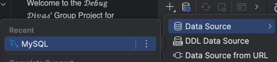
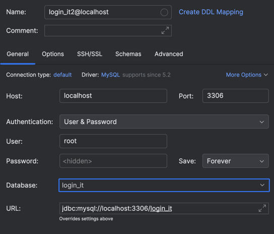
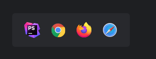

# CEN3031-Final-Group-Project

Welcome to the 𝒟𝑒𝒷𝓊𝑔 𝒟𝒾𝓋𝒶𝓈' Group Project for CEN3031!

# Instructions on running website:

1) Download PHPMyAdmin
   1) Once PHPMyAdmin is open, select "New" to create a database
   2) Create a db named login_it
2) Download the tables for the database, which can be found in the SQL files folder in this project.
   1) There should be called: users, tickets, chats, and livechats
3) Place these tables within the login_it database
4) Download PHPStorm
5) Download this project from the GitHub repository
6) Connect your PHPMyAdmin database to PHPStorm
   1) Select the "Database" tab in phpstorm 
   
   2) Press the "+" button, then "Data Source", and then "MYSQL"
   
   3) Input the database name as login_it and make sure the host is localhost, the port is whatever you have phpmyadmin connected to, and the user is root. the password should be null.
   
7) Open the project in phpStorm and utilize the localhost hosting ability to view a local version of the site live
   1) You are looking for this: 
8) You should now be able to run this website locally!